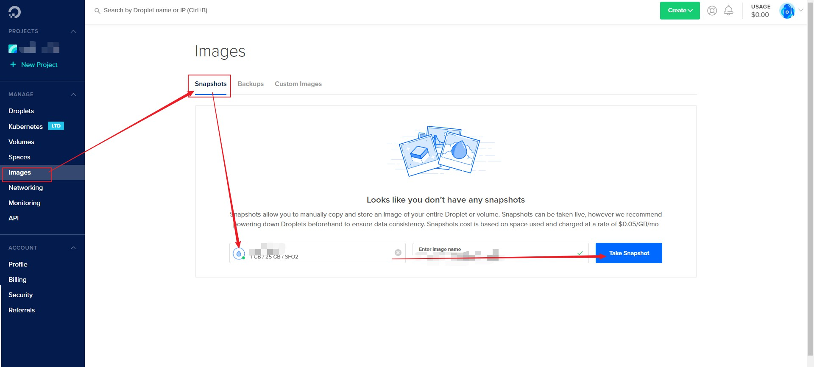
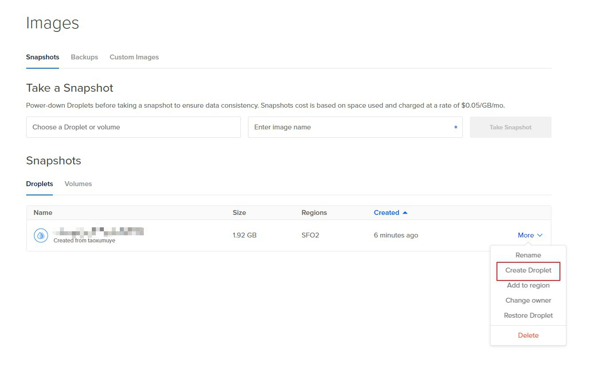

# DO VPS IP被封 - 更换droplet

## 1.创建备份Snapshots



## 2.从备份中新建Droplet



## 3.新droplet配置跟以前一样

## 4.登录，改root密码

用户名：root

密码：DO发了一封邮件到你的注册邮箱，上面有新droplet的初始密码

## 5.启动ssserver

```shell
ssserver -k yourpassword -d start
```

## 6.（与ss无关）别忘记启动其它你需要的服务

例如你的网页nginx服务等

## 7.Delete Snapshots

## 8.Detete IP被封的那个Droplet