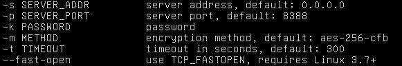

# 【GitHub学生礼包】 **之** Digital Ocean搭建VPS + Shadow Socks搭建


## 1. GitHub学生礼包

网址：[education.github.com](https://education.github.com)


通过你所在学校的邮箱进行验证(如***@sjtu.edu.cn)，通过后即可获得这个 “GitHub Student Developer Pack”，我的邮箱不到半小时就收到了审核通过的邮件。

礼包内容很多，这里我们需要用到的是如下两个：


## 2. Digital Ocean注册与搭建VPS

- 注册链接：[**`注册Digital Ocean:`**https://m.do.co/c/a5b36073b3b3](https://m.do.co/c/a5b36073b3b3)，通过此分享链接注册，你可以再获取10$优惠券哦（我也会获取等额优惠哈哈）

- 注册过程需绑定信用卡，若无，可用pay-pal注册，而pay-pal帐号可绑定国内的银联支付，因此只需注册一个paypal帐号即可。绑定后，会从卡中扣除5$的初始金额，以确认支付能力，会充值到digital ocean账户中。

- pay-pal绑定银联卡后需注意，亲测我的招行借记卡给digital ocean付款失败，而另一张62开头的中行借记卡支付成功，似乎这个62开头也比较重要。

  

- 最后就是登录DO，建立一个新的droplet

  1. 地区：本人在上海，综合知乎上各位大佬的测速信息，我选择了旧金山机房，速度相对最快且稳定。
  2. 配置：我选的最低配置，5刀每月。由于你刚刚充值5刀，加上进入我的注册链接后注册得到的10刀优惠券，因此，你当前账户里有15刀，可用3个月。若是后面再加上github提供的优惠，则可免费使用更长时间。


## 3.搭建Shadow Socks

0. 前言

      我新建droplet时，选的是Ubuntu16.04系统，后面的代码也都是在此系统下执行的。如下图进入console控制台

      

      初始帐号密码：详见邮件即可，DO已发送了root密码到你的注册邮箱。

      初次登陆后，会立刻要求更改root密码，初始密码超级长，有二十多个字符，所以请提前准备好一个简单的root密码哦

      *注：后面所有命令都在root下执行*

1. 安装python、shadow socks等

   ```shell
   apt install python
   apt update
   apt install python-pip
   pip install shadowsocks
   ```

2. shadow socks的配置与start、stop

   START：

   - 这里有两种方式启动ssserver（即ShadowSocksSERVER） 

   1. 通过新建一个.json配置文件来启动

      ```shell
      ssserver -c XXX.json -d start
      ```

      网上基本都是这种方法，此处不作介绍。本人一般用下面这个简单的方法。

   2. 默认配置，直接启动

      ```shell
      ssserver -k yourPassword -d start
      ```

      ssserver默认值*“default”*如图

      

   STOP：

   ```shell
   ssserver -d stop
   ```

   

3. 本地客户端

   **Windows**

   - 下载链接：[Shadowsocks-4.0.10.zip](https://github.com/shadowsocks/shadowsocks-windows/releases/download/4.0.10/Shadowsocks-4.0.10.zip)

   - 本地客户端常见问题：[.NET版本过低](http://dotnetsocial.cloudapp.net/GetDotnet?tfm=.NETFramework,Version=v4.6.2)

   - 客户端配置如图：

     

   **ios**

   - 1. [安装pp助手](http://pro.25pp.com/)

        

     2. 在pp上安装Shadowrocket，如下图

        


   

   

