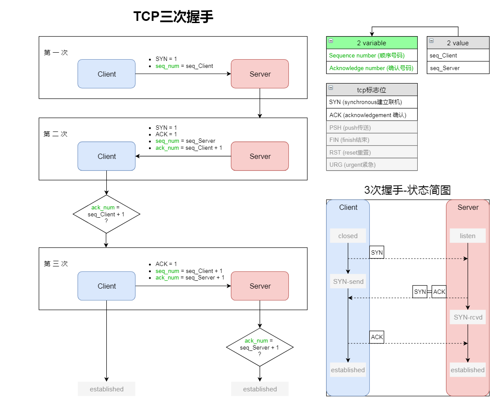

# TCP三次握手

## 一. 握手过程 - 图解

## 二. 为什么是3次

1. **一句话概括**：

    为了防止“已失效的SYN请求报文”突然又传到了Server端，而产生错误connection

1. **详情**：

    例如，一个Client发送了第一个SYN请求报文到Server，将其取名为syn1。
    
    但由于不明原因，syn1在某个网络节点上滞留了。
    
    于是Client又发送了syn2，并顺利完成3次握手、data传递、4次挥手断开连接。

    而后，syn1终于到达了Server,此时分析如下：

    - 无3次握手：则Server直接建立了一个错误连接，浪费了计算机资源

    - 有3次握手：Server向Client发送第二次握手，以确认此连接，但Client那边连接早就结束了，确认失败，Client不予理会，不提供第三次握手，于是不会建立连接

## 三. 缺陷 与 SYN Flood攻击

### 3.1 SYN Flood详解

- 类别属性：
    
    SYN- Flood攻击是当前网络上最为常见的DDoS攻击，也是最为经典的拒绝服务攻击

- 原理：

    1. 攻击者伪造一个或多个Client的ip地址，向Server发送**大量**的SYN请求（第一次握手）。
    2. 然后，Server对它们发送(SYN+ACK)报文，进行第二次握手，但却发送到了这些伪造的ip对应的真实的Client那里。
    3. 这些Client实际上并没有发送SYN请求，于是不予理会，不进行第三次握手。
    4. Server不知道(SYN+ACK)是否发送成功，默认情况下会重试5次（tcp_syn_retries）。
    5. 最终，造成目标服务器中的半开连接队列被占满，从而阻止其他合法用户进行访问。

### 3.2 防护措施

1. 达到一定阈值时，无效连接监视释放（半开连接和不活动连接）

1. 延缓TCB分配

    TCB资源是什么？这部分未完待续

    - Syn Cache技术？

    - Syn Cookie技术？

1. SYN Proxy防火墙

    对试图穿越的SYN请求进行验证之后才放行

  

---

参考文献：

> [TCP3次握手和4次挥手及其为什么](http://www.cnblogs.com/saolv/p/7807677.html)

> [TCP3次握手，4次挥手过程](https://piaosanlang.gitbooks.io/spiders/content/01day/tcp3ci-wo-shou-ff0c-4-ci-hui-shou-guo-cheng.html)

