# Lesson 1 你我他

 

## Vocabulary

> **hola**

hello

> **buenos días**

good morning

> **buenas tardes**

good afternoon

> **buenas noches**

good night

> **adiós**

goodbye

> **hasta luego**

see you later

> **hasta mañana**

see you tomorrow

> **¿Cómo te llamas?**

what is your name?

> **Me llamo ...**

My name is ...

> **¿Hablas español?**

Do you speak Spanish?

> **Yo hablo español.**

I speak Spanish.

> **No hablo español.**

I don´t speak Spanish.

> **¿Cómo estás?**

How are you?

> **bien**

fine

> **así, así**

so, so

> **Sí**

Yes

> **por favor**

please

> **gracias**

thank you

> **de nada**

you are welcome

> **perdón**

excuse me

     