# Lesson 2 两种助动词

 

## Example

> **Yo soy** un programador.

(programador: programmer, a kind of **O**ccupation)

> **Él está** triste.

(triste: sad, a kind of **T**emporary feeling)

## Vocabulary

> **español**

spanish

> **inglés**

english

> **francés**

french

> **alemán**

german

> **chino**

chinese

 

[next lesson](../L3_verbs_with_ar/index)

    

