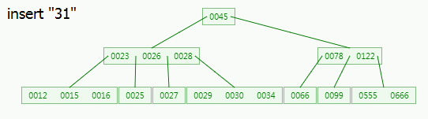

# B-tree

## 1. 二叉搜索树的不足

## 2. Remedy of BST

**self-balancing tree**

- red-black tree

- B tree

  B树在降低磁盘IO操作数方面要更好一些（相比于红黑树）

## 3. B-tree

3.1 GIF Show：**INSERT**

3.2 Time Complexity

Always $O(log(n))$ 

for **SEARCH, INSERT, DELETE** operations

