# B-tree

## 1. 二叉搜索树的不足

## 2. Remedy of BST

**self-balancing tree**

- red-black tree

- B tree

**comparison** of self-balancing trees

- B树在降低磁盘IO操作数方面要更好一些（相比于红黑树）
- B树高度要比红黑树小很多（原因是log的底数可以非常大）

## 3. B-tree

### 3.1 GIF Show：**INSERT**

### 3.2 Time Complexity

Always $O(log(n))$ 

for **SEARCH, INSERT, DELETE** operations

### 3.3 Definition of B-Tree

**BTreeNode** node

- node.**n**：the amount of keys in the node
- node.**key1**, node.**key2**, ..., node.**keyn**：keys in the node
- node.**leaf**：bool，whether it is a leaf-node or inside-node
- node.**child1**, node.**child2**, ..., node.**childn+1**：pointers to its children

Order of the keys：**Asc**

- any **key**s in child1 <= **key1** <= any **key**s in child2 <= **key2** <= ... <=  any **key**s in childn+1

Minimum Degree **N**

- children amount >= N   （**n** >= N-1）（Except root Node）
- children amount <= 2N （**n** <= 2N-1）

  