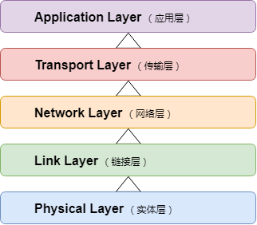

# 互联网协议基础 之 五层网络模型

- 互联网的核心是一系列协议，总称为“**互联网协议组**”（Internet Protocol Suite）

- 五层网络模型

  - 每一层都定义了很多协议
  - 每一层都是为了完成一种功能

  

## 一. 实体层（Physical Layer）

即物理硬件层，由电子元件组成，负责产生发送“*高低电平1/0*”电信号

## 二. 链接层（Link Layer）

1. 功能：规定0/1的组合方式，给每种组合方式赋予特定含义

2. **以太网（Ethernet）协议**

   该协议规定：一组电信号构成一个数据包，叫做“帧”（Frame），由标头（Head）和数据（Data）组成。

   

3. MAC地址

   Head中要包含发送者和接收者的标识信息，如何标识？

   - **以太网规定：入网设备都需要有“网卡”**

   - 两块网卡的地址，就是数据包的发送地址和接收地址，即**MAC地址**。

   - 理论上，每块网卡出厂的时候，都有一个全世界独一无二的MAC地址，长度是48个二进制位，通常用12个十六进制数表示 

     |    MAC Address    |
     | :---------------: |
     | 00-1F-D1-76-CC-B5 |

   以上，便确定了通信双方在网络中的位置

4. 广播（broadcasting） 

   一块网卡如何才能知道另一块网卡的MAC地址？

   - ==ARP协议==

   有了对方MAC地址后，数据包如何到达这个地址？

   - 广播：实际上，数据包到达了网络中所有计算机的地址
   - 由其余计算机自身进行选择：接收/忽略这个Frame
   - if(**this_MAC == coming_Frame_MAC**){receive_data;} else{ignore_it;}

## 三. 网络层（Network Layer）

## 四. 传输层（Transport Layer）

## 五. 应用层（Application Layer）

  

----

参考文献：

> [互联网协议入门](http://www.ruanyifeng.com/blog/2012/05/internet_protocol_suite_part_i.html)

