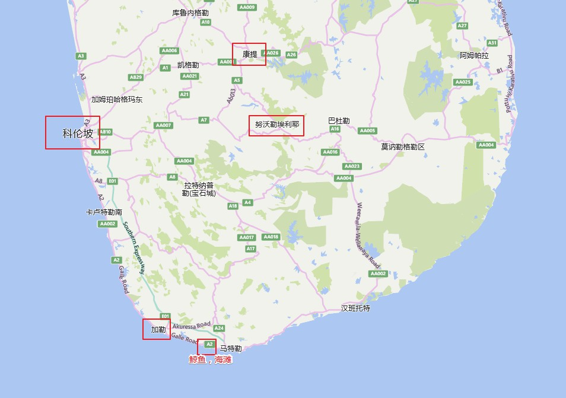
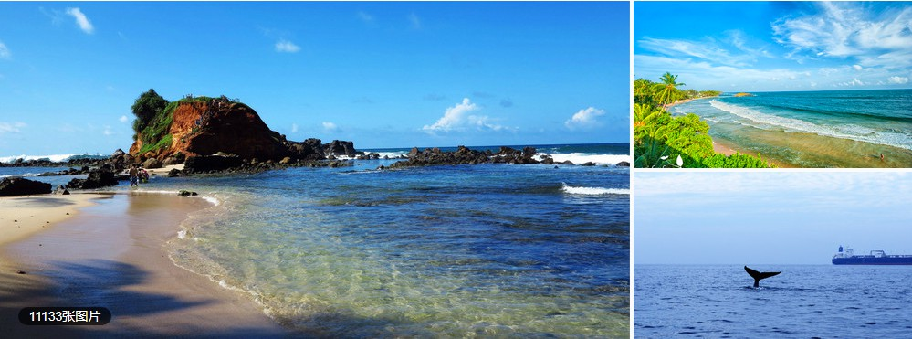
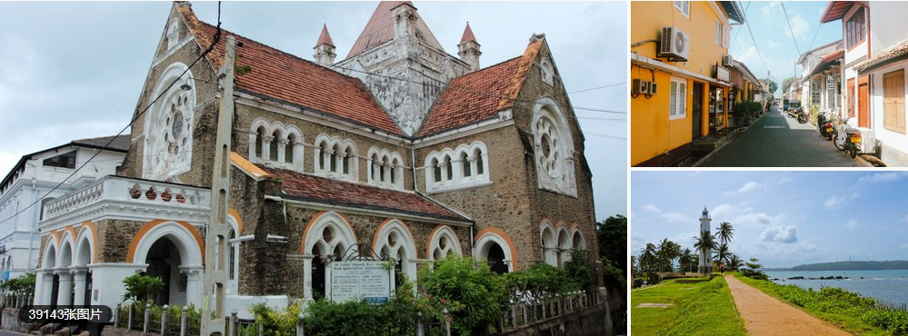
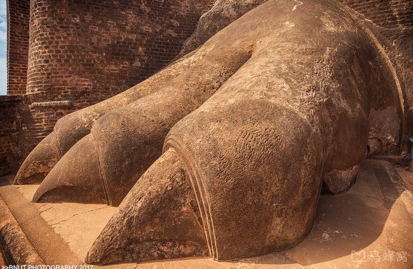
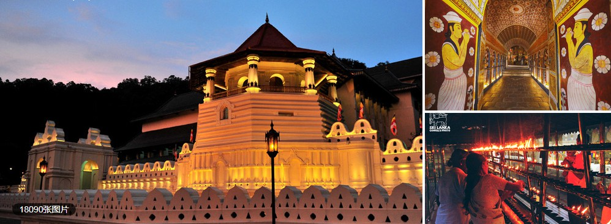
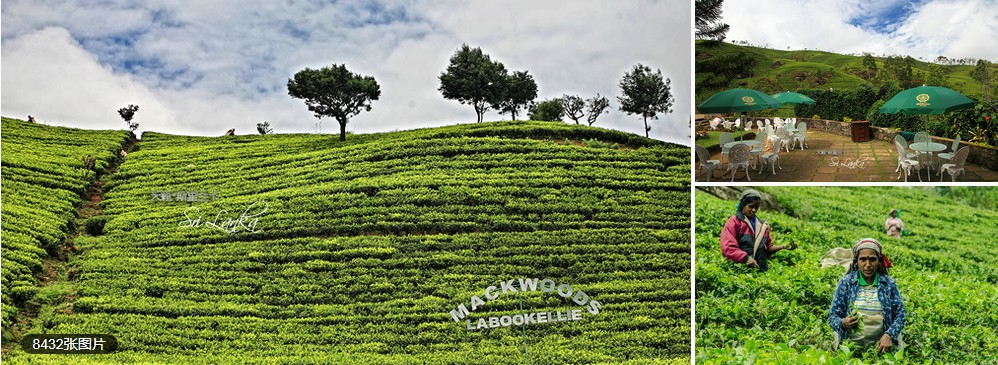

# 斯里兰卡 - 十日游览路线（by牧野）

#`DAY1`

### 首都（科伦坡）

？

### 美蕊沙（Mirissa）

- [美蕊沙海滩](http://www.mafengwo.cn/poi/35163.html)

  

  南部沿海城市，可出海观鲸

### 加勒（Galle）

- [加勒城堡](http://www.mafengwo.cn/poi/34904.html)

  

  加勒火车站附近，南部沿海城市，门票免费，适合散步，1~3小时

### 丹布勒（Dambulla）

- [狮子岩](http://www.mafengwo.cn/poi/6661514.html)

  

  45分钟长途汽车，内陆，门票30美元，世界第八大奇迹，3小时

### 康提（Kandy）

- [佛牙寺](http://www.mafengwo.cn/poi/34893.html)(我不信佛，有人信嘛？)

  

  门票1000卢比（拍照另付300卢比），1小时以内

- [康提湖](http://www.mafengwo.cn/poi/35174.html)

  

  佛教圣地康提市中心

### 努沃勒埃利耶（Nuwara Eliya）

- [霍尔顿平原国家公园](http://www.mafengwo.cn/poi/5442864.html)

  

  从努沃勒埃利耶可以包车前往，车程约1.5小时，人均约3500卢比，含门票。最晴朗的季节是1月到3月，昼夜温差大。

- [Mackwoods茶厂](http://www.mafengwo.cn/poi/5485575.html)

  

  约1小时车程，可以租Tuk-tuk车往返，费用大约在600-1000卢比左右，参观免费

# 未完待续，正在汇总...