# 斯里兰卡十日游记

## ——我的硕士毕业旅行

2019年1月14日，我通过了硕士生毕业答辩。在完成了一系列后期归档工作后，计划于春节过后进行一场期待已久的毕业旅行。

恰逢同实验室的几位博士也于年前结束了毕业答辩，遂决定几人搭伴前行。

节后，我、师姐、达哥在土耳其、新西兰、斯里兰卡等选项中踌躇良久后，考虑到花销、安全、签证周期等因素，最终选定了热带岛国——斯里兰卡。

结合网上的攻略，我们制订了自己的十日游玩计划，全程包车，行程跨越大半个国家。

## DAY 1

上海浦东出发，香港转机，于北京时间8日凌晨2:10抵达斯里兰卡（当地时间为前一日的23:40）。

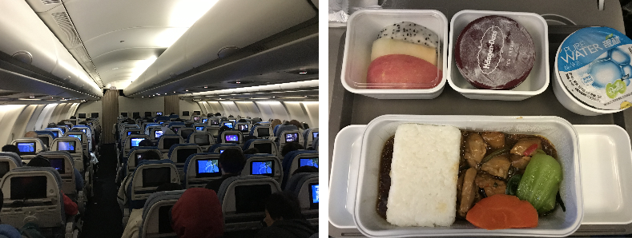

入境，兑换货币，面见司机小哥Sanka，一路左行，最终抵达位于尼甘布的民宿（Home-Stay）。头顶一个巨大的风扇，伴着一夜的螺旋桨声音，闷热而无眠。天亮起床后，3人的精神状态却都还不错。

品尝过当地的早餐食物Hopper后，我们逛了逛尼甘布清晨的鱼市，便出发前往阿努拉德普勒古城。这段路程没有高速，行驶在慢悠悠的国道上，倒是让我们好好欣赏了一下斯里兰卡的乡间风貌，可以说是满眼绿色，热带植被茂盛，生态优良。

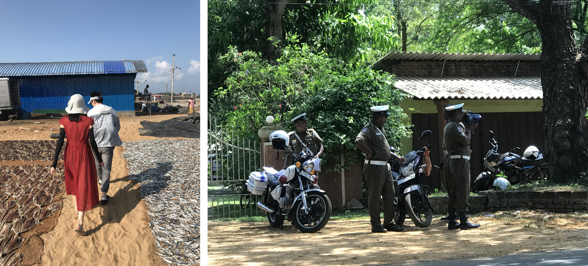

阿努拉德普勒是斯里兰卡古代的佛教圣城，现存有大量的佛教建筑遗址，为表虔诚，朝拜或参观时均不允许穿鞋。本人对佛教并无太多了解，此行最大的感受就是，烫脚烫脚好烫脚哈哈。所以，请及时躲在阴影里，更要穿好袜子~

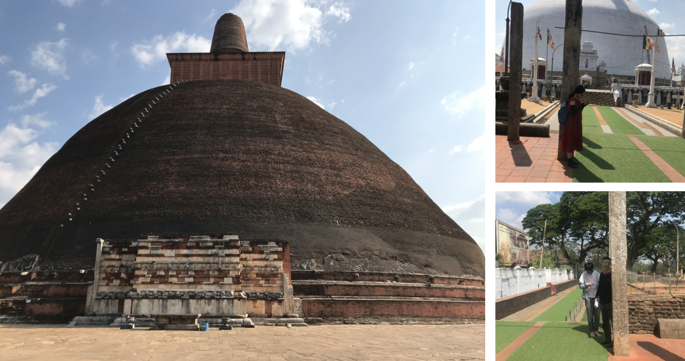

深刻地体会了一整天的热带大太阳后，我们下午早早抵达了宾馆（Hotel）。宾馆的环境着实不错，不仅有空调，花园内还建有一个游泳池。晚饭后，师姐和达哥在里面游了近一个小时，我则穿戴好两只浮袖，脚踩着泳池底部，来来回回“直立行走”了好多圈。（没想到第一次进游泳池是在国外）

## DAY 2

这一夜睡得很好，临行前跟宾馆老板聊了会天，接近上午10点的时候，我们出发前往丹布勒石窟寺。这座寺庙建在一座小山上，在山洞中，古人们开凿出了一座座佛像供人朝拜，山上生态环境同样很好，可以看到一群小猴子在玩耍，并不畏惧游客。

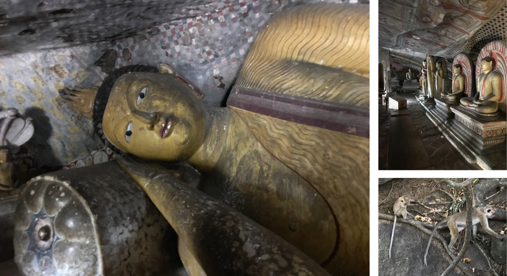

下山后，我们在一家评分较高的西餐小馆解决了午饭问题，小餐馆环境非常别致，拥有一个竹子制成的巨大伞盖，日常接待游客较多，涂鸦墙上布满了留言。

斯里兰卡的锡吉里耶有一座著名的岩石山，与其说是山，不如说是一块超级巨大的岩石，它的名字叫做狮子岩。狮子岩顶部平整且异常宽广，古代曾有一位国王将王宫建于其上，并耗费巨大人力将其雕刻成了一个狮子的形状。如今，狮头早已脱落不见，但顶部仍留下了大量的王宫地基遗址，风化至今。下午，我们登上了这座岩石山，站在当年国王的位置，一览山下广袤的森林平原。

## DAY 3

3月10日，酒店的竹帘古色古香，但其遮光能力基本可以忽略不计，我早早便起床洗漱完毕。然而达哥的睡眠质量也是令人服气，最终只得大声将其叫醒。

早餐是酒店提供的西式自助，Omelette煎蛋卷的味道值得称赞，餐厅环境优雅，用餐体验良好。

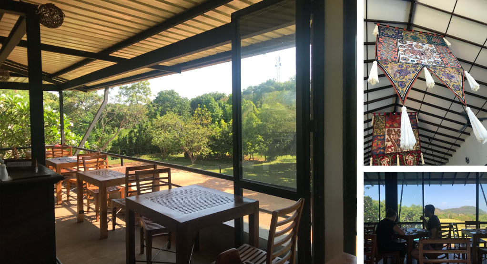

饭后，我们从丹布勒出发，驱车前往康提。康提是斯里兰卡现今的佛教圣城，供奉着佛祖牙齿的佛牙寺便坐落于这座城市中心，毗邻康提湖。寺内祭祀与朝拜等活动均于晚间举行，于是我们决定白天游玩皇家植物园。园内热带植物繁茂多样，树木高大浓密，空中飞着好多不惧正午日晒的蝙蝠，1500卢比的门票可谓是性价比较高。

下午，我们到康提的民宿内略作休息，于17:00出发前往佛牙寺。寺内信徒众多，全球各地的游客也不少，大家围成一圈看着场地中央的宗教表演。

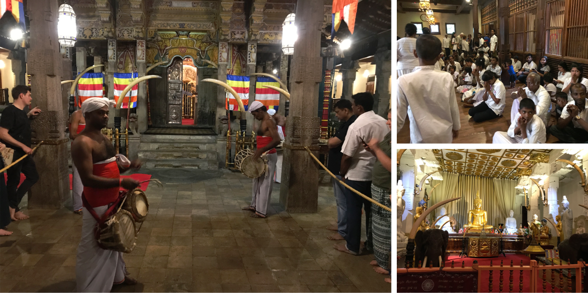

康提的民宿多为山景房，微风吹拂，景色宜人，住宿条件堪比宾馆。

入夜，山下的城市灯光好似繁星点点。

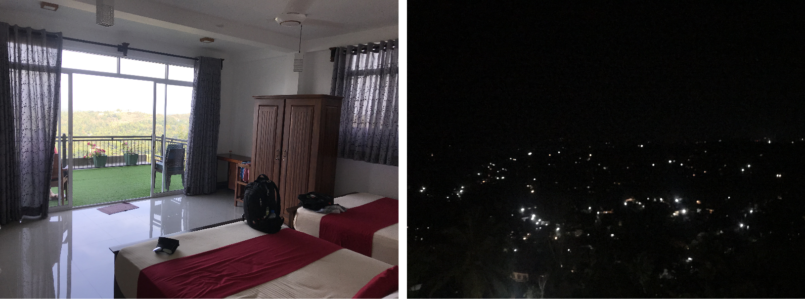

## DAY 4

这家山景民宿的早餐较为丰盛，图中的“碗状”面点就是当地的Hopper，边缘的口感类似于国内的煎饼，底部则与发糕的松软多孔形态相同。老板娘在Hopper里面给我们一人放了一个煎蛋，达哥吃得很嗨。

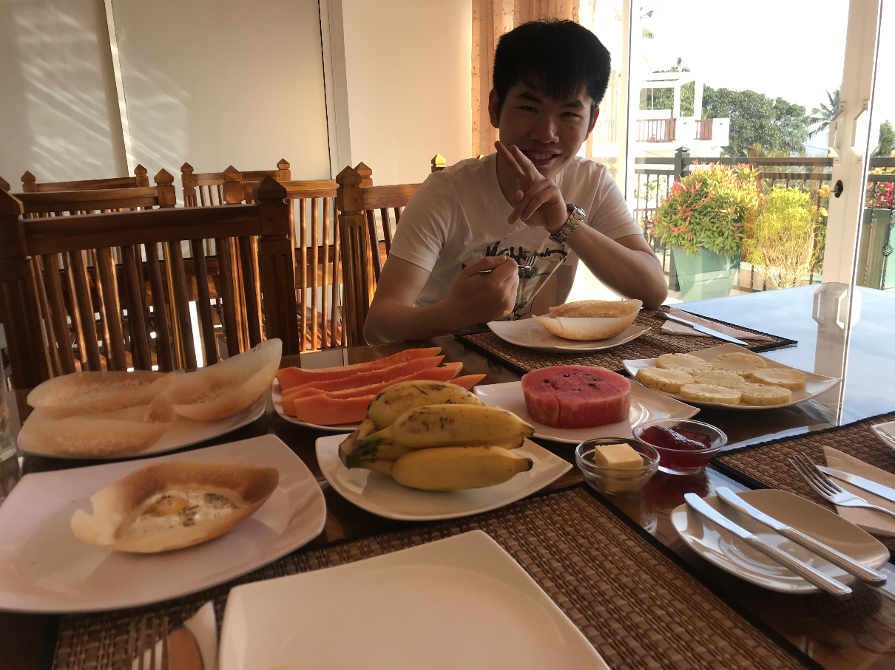

这一日的第一个目的地是位于努沃勒埃利耶的Mackwoods茶厂，然而，司机小哥Sanka告诉我们，这个茶厂前段时间换了主人，已被该国的首富收购，因此更名为Damro茶厂。

去茶厂的途中，我们路过一个草莓种植园，品尝了一杯极其浓稠的鲜榨草莓汁，展板上详细标注了多个草莓品种。

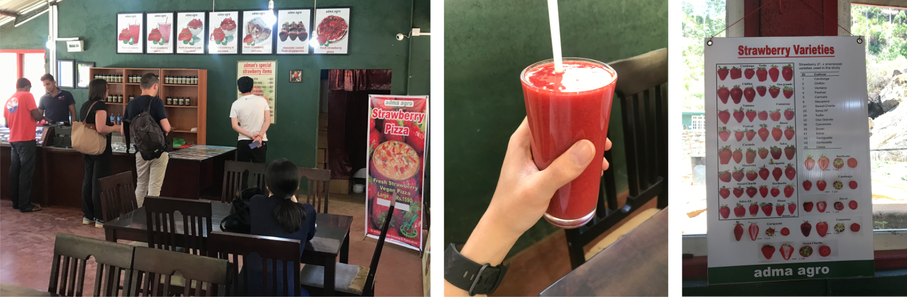

茶厂本身也是一个出名的旅游景点兼销售点，建筑装潢都比较现代化。进入茶厂，会有专门的工作人员带领大家免费参观、讲解、品尝，工厂参观完毕后，讲解员就会立即离开，迎接下一批旅客。如有购买意愿，可自行前往销售大厅。销售大厅的二楼是一家自助餐厅，味美价廉，餐厅落地窗外是大片的茶山，可以边吃边欣赏窗外美景。

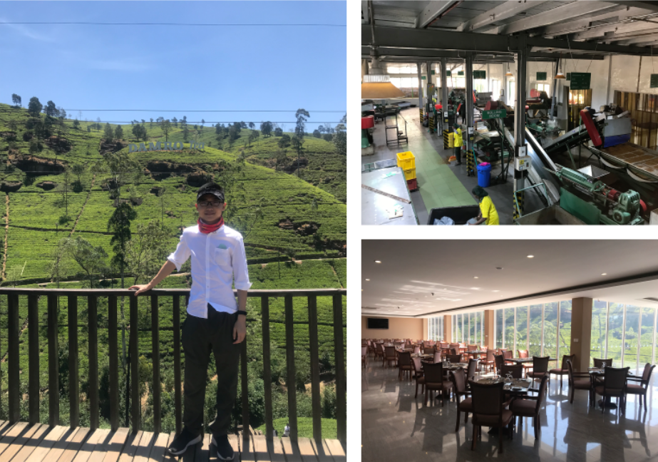

离开茶厂时已是下午，我们去了当地的一个公园，在一个狭长的湖泊上，体验了一把Jet-ski，爽翻！

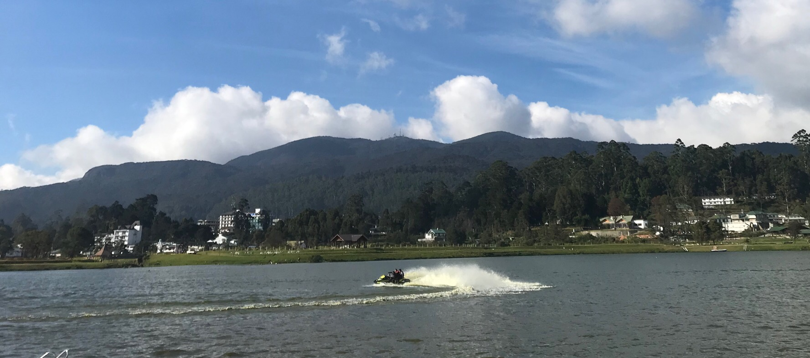

晚上抵达民宿，房主热情好客，给我们看了很多中国人的留言日记，上面多次提到这家的早餐非常好吃，让我们不免有些期待。

斯里兰卡虽是热带国家，但地处山区的努沃勒埃利耶市的晚上还是比较冷的，这一夜盖着厚实的毛毯，睡得很香。

## DAY 5

12日凌晨4:30起床，黎明前的小镇静悄悄的，夜空中的星星清晰可见。

霍顿平原国家公园适合在天气凉爽的上午徒步游玩，因此我们一早便踏上了行程。

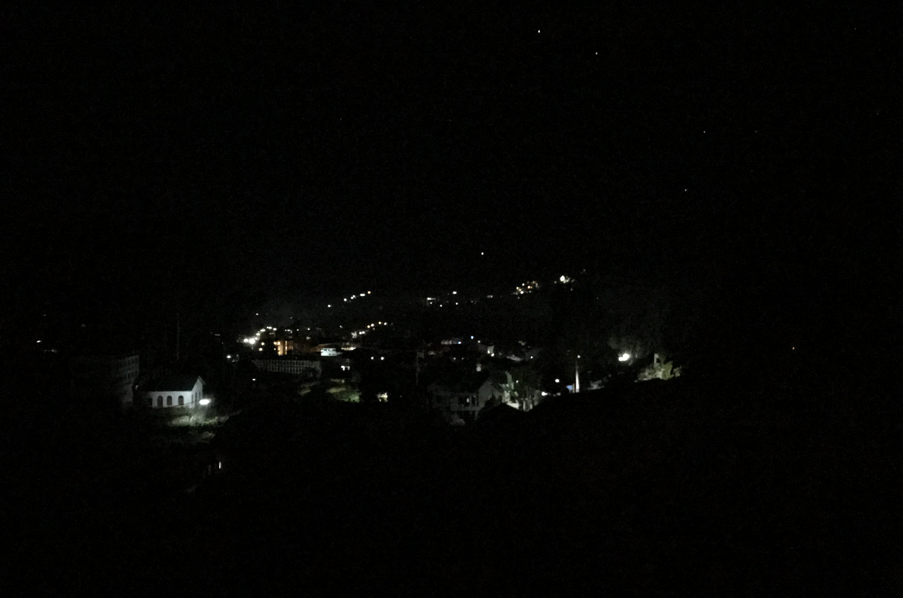

这一段全是山路，黎明曙光中，道路蜿蜒崎岖，Sanka对这段路较熟，车开得很稳。

进入霍顿平原时，朝阳微微升起，在草甸上洒下一片金黄。

平原内的景色很美，有山有河流，有森林也有广袤的草原，非常适合徒步和摄影。

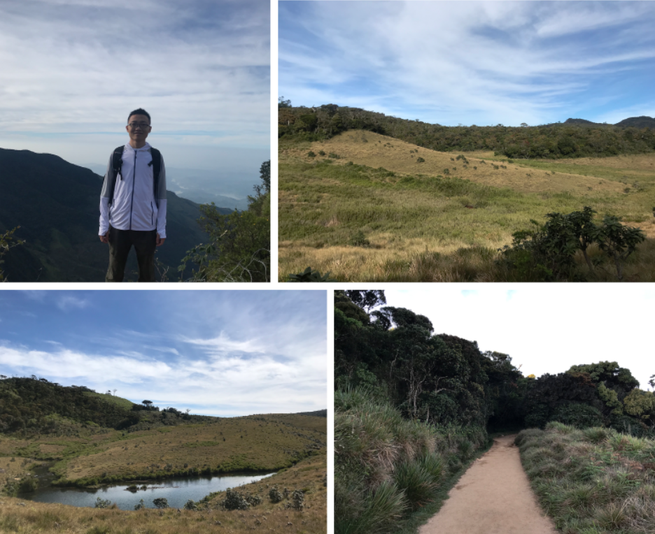

一直玩到中午11点，我们离开霍顿平原，向南部沿海地区进发。

途径OHIYA，这里有一班到埃勒的小火车，车上挤满了人高马大的欧美游客，达哥不畏艰险地挤了上去，我和师姐坐着Sanka安稳的小轿车，与其同时抵达埃勒。

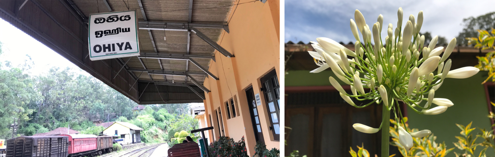

从埃勒到蒂瑟默哈拉默，路上野生动物渐多，Sanka经常指着在路边散步的蜥蜴和孔雀让我们看。

傍晚抵达宾馆，这是我们住的第三家Hotel，同样在精美的花园中建有一座游泳池。灯光环绕中，我们在水里泡了约近一小时，在师姐和达哥的指导下，我终于摆脱直立姿态，可以缓慢划水啦，只是......前进方向随机~

## DAY 6

雅拉国家公园是亚洲唯一的原始野生丛林公园，是我们此行的重头戏之一，按当地规定，需搭乘专门的吉普车前往。前一天晚上，Sanka已帮我们预定好了一个8座大吉普，相当宽敞舒适。

带着宾馆给打包好的早餐，天还未亮，便整装出发。欣赏过火红的朝霞后，我们便驶入了雅拉国家公园。吉普车虽有结实的护栏扶手，但并无网状隔离板，路遇一只好奇心颇重的大象，跟3辆车依次来了个亲密互动。眼看着这大长鼻子朝我伸了过来......赶紧换了个座位......

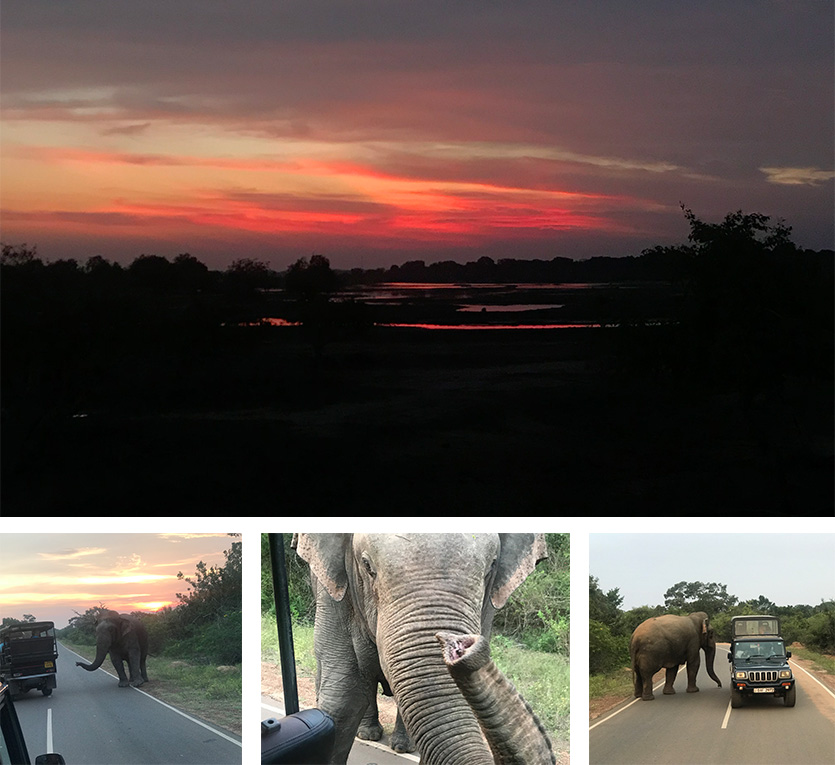

孔雀、野牛、蜥蜴、色彩斑斓的小鸟、野猪群、猫鼬、鳄鱼、梅花鹿群，这一路上见识了各种各样的野生动物。

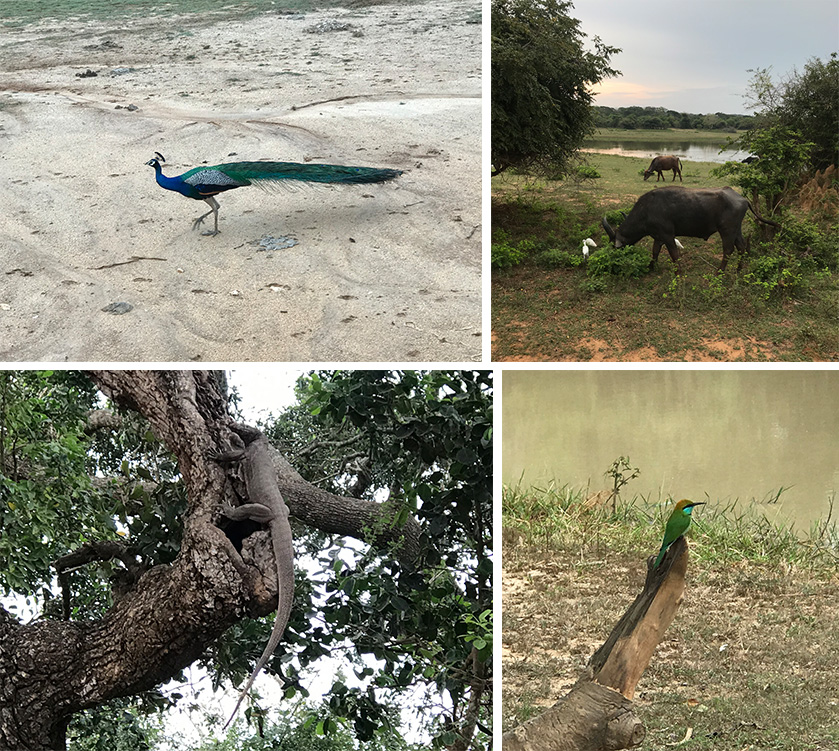

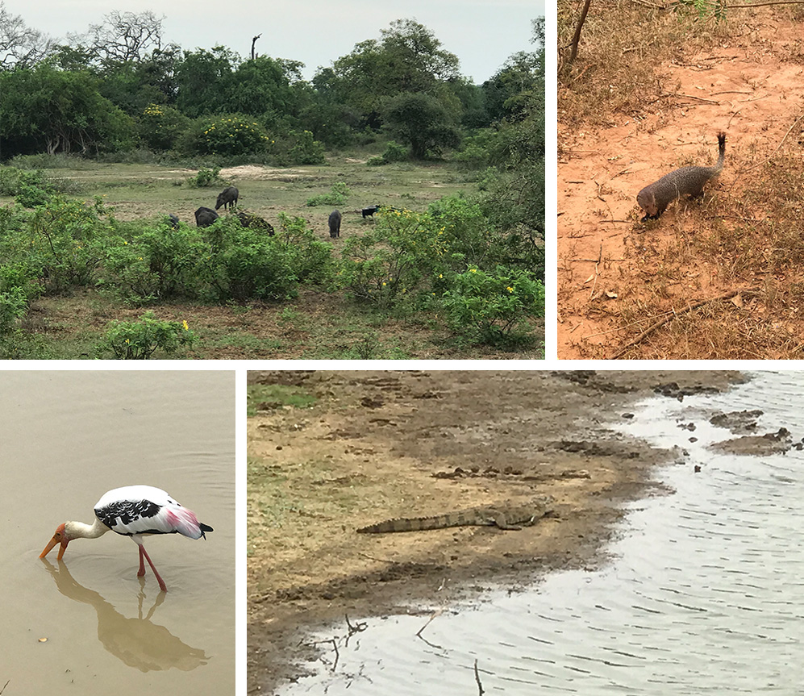

吉普车司机大概是比较怕冷，在炎热的夏天里仍戴着顶针织棉帽子。穿蓝色T恤的是我们的司机Sanka。

一路开到雅拉的海边，我们下车休整，顺便拍拍拍。

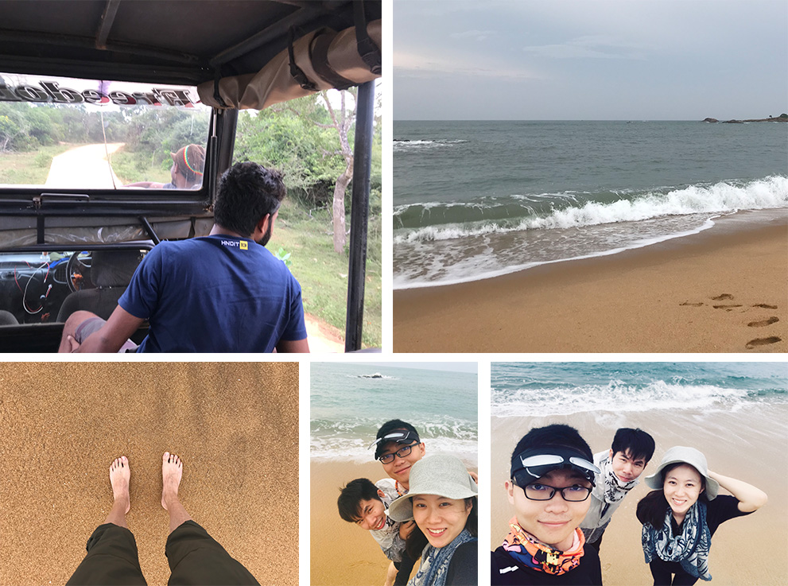

这两天起得太早，归程中在吉普车上小睡了一会。回到蒂瑟默哈拉默后，简单洗个澡，便直奔附近的餐厅，图中的蔬菜沙拉很好吃。

下午，酒足饭饱后，坐回Sanka的轿车，驶向米瑞莎海滩。

当晚是一个有空调的民宿，名为Resort of Happiness，入住体验良好。

## DAY 7

