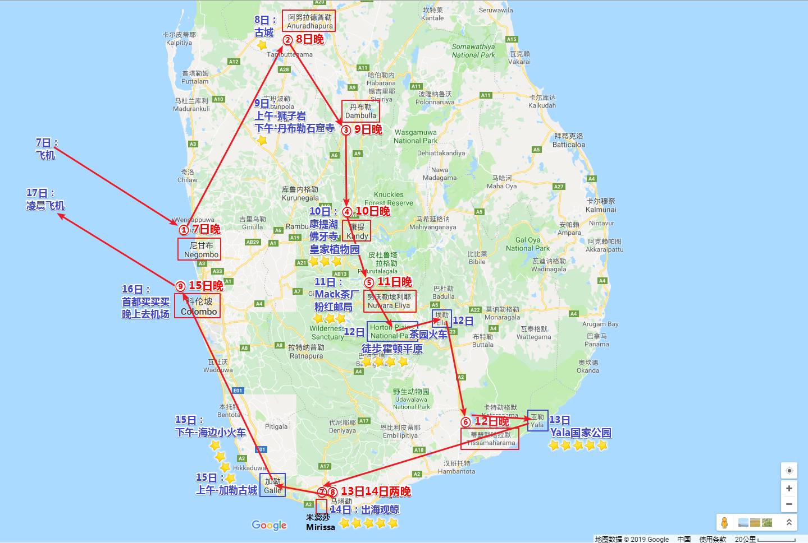

# 斯里兰卡十日游记

## ——我的硕士毕业旅行

2019年1月14日，我通过了硕士生毕业答辩。在完成了一系列后期归档工作后，计划于春节过后进行一场期待已久的毕业旅行。

恰逢同实验室的几位博士也于年前结束了毕业答辩，遂决定几人搭伴前行。

节后，我、师姐、达哥在土耳其、新西兰、斯里兰卡等选项中踌躇良久后，考虑到花销、安全、签证周期等因素，最终选定了热带岛国——斯里兰卡。

结合网上的攻略，我们制订了自己的十日游玩计划，全程包车，行程跨越大半个斯里兰卡。

## DAY1

上海浦东出发，香港转机，于北京时间8日凌晨2:10抵达斯里兰卡（当地时间为前一日的23:40）。

入境，兑换货币，面见司机小哥，一路左行，最终抵达位于尼甘布的民宿。头顶一个巨大的风扇，伴着一夜的螺旋桨声音，闷热而无眠。天亮起床后，3人的精神状态却都还不错。

品尝过当地的早餐食物Hopper后，我们逛了逛尼甘布清晨的鱼市，便出发前往阿努拉德普勒古城。这段路程没有高速，行驶在慢悠悠的国道上，倒是让我们好好欣赏了一下斯里兰卡的乡间风貌，可以说是满眼绿色，热带植被茂盛，生态优良。

阿努拉德普勒是斯里兰卡古代的佛教圣城，现存有大量的佛教建筑遗址，为表虔诚，朝拜或参观时均不允许穿鞋。本人对佛教并无太多了解，此行最大的感受就是，烫脚烫脚好烫脚哈哈。所以，请及时躲在阴影里，更要穿好袜子~

深刻地体会了一整天的热带大太阳后，我们下午早早抵达了宾馆。宾馆的环境着实不错，不仅有空调，花园内还建有一个游泳池。晚饭后，师姐和达哥在泳池里游了近一个小时，我则穿戴好两只浮袖，脚踩着泳池底部，来回“走”了好多圈。

## DAY2

