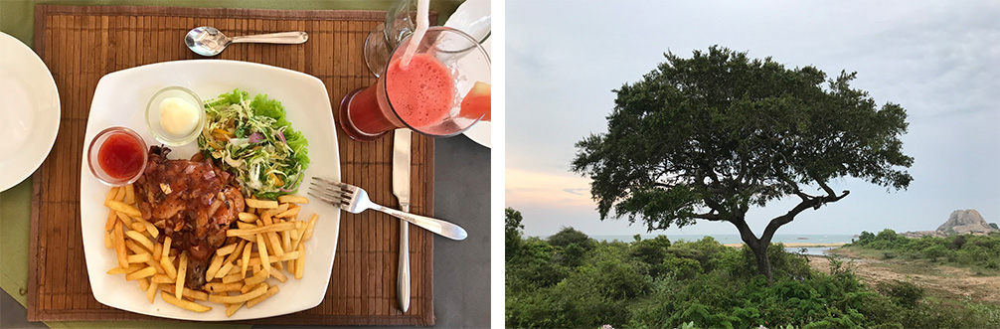
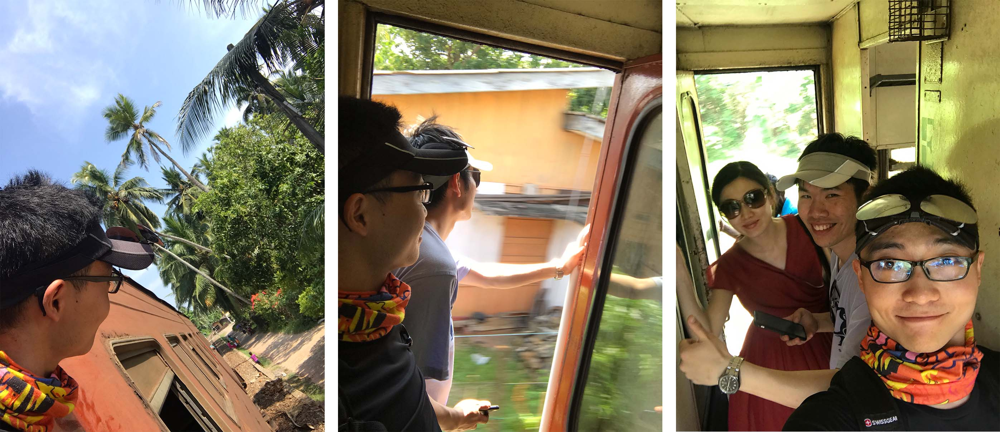

# 斯里兰卡十日游记

## ——我的硕士毕业旅行

> 作者：牧野TX（polarbear0330）

2019年1月14日，我通过了硕士生毕业答辩。在完成一系列后期归档工作后，计划于春节过后进行一场期待已久的毕业旅行。

恰逢同实验室的几位博士也于年前结束了毕业答辩，遂决定几人搭伴前行。

节后，我、师姐、达哥在土耳其、新西兰、斯里兰卡等选项中踌躇良久后，考虑到花销、安全、签证周期等因素，最终选定了热带岛国——斯里兰卡。

结合网上的攻略，我们制订了自己的十日游玩计划，全程包车，行程跨越大半个国家。

## DAY 1

上海浦东出发，香港转机，于北京时间8日凌晨2:10抵达斯里兰卡（当地时间为前一日的23:40）。

入境，兑换货币，面见司机小哥Sanka，一路左行，最终抵达位于尼甘布的民宿（Home-Stay）。头顶一个巨大的风扇，伴着一夜的螺旋桨声音，闷热而无眠。天亮起床后，3人的精神状态却都还不错。

品尝过当地的早餐食物Hopper后，我们逛了逛尼甘布清晨的鱼市，便出发前往阿努拉德普勒古城。这段路程没有高速，行驶在慢悠悠的国道上，倒是让我们好好欣赏了一番斯里兰卡的乡间风貌，可以说是满眼绿色，热带植被茂盛，生态优良。

阿努拉德普勒是斯里兰卡古代的佛教圣城，现存有大量的佛教建筑遗址，为表虔诚，朝拜或参观时均不允许穿鞋。本人对佛教并无太多了解，此行最大的感受就是，烫脚烫脚好烫脚哈哈。所以，请及时躲在阴影里，更要穿好袜子~

深刻地体会了一整天的热带大太阳后，我们下午早早抵达了宾馆（Hotel）。宾馆的环境着实不错，不仅有空调，花园内还建有一个游泳池。晚饭后，师姐和达哥在里面游了近一个小时，我则穿戴好两只浮袖，脚踩着泳池底部，来来回回“直立行走”了好多圈。（没想到我第一次进游泳池是在国外）

## DAY 2

这一夜睡得很好，临行前跟宾馆老板聊了会天，接近上午10点的时候，我们出发前往丹布勒石窟寺。这座寺庙建在一座小山上，在山洞中，古人们开凿出了一座座佛像供人朝拜，山上生态环境同样很好，可以看到一群小猴子在玩耍，并不畏惧游客。

下山后，我们在一家评分较高的西餐小馆解决了午饭问题，小餐馆环境非常别致，拥有一个竹子制成的巨大伞盖，日常接待游客较多，涂鸦墙上布满了留言。

斯里兰卡的锡吉里耶有一座著名的岩石山，与其说是山，不如说是一块超级巨大的岩石，名为狮子岩。狮子岩顶部平整且异常宽广，古代曾有一位国王将王宫建于其上，并耗费巨大人力将其雕刻成了一个狮子的形状。如今，狮头早已脱落不见，但顶部仍留下了大量的王宫地基遗址，风化至今。下午，我们登上了这座岩石山，站在当年国王的位置，一览山下广袤的森林平原。

## DAY 3

3月10日，酒店的竹帘古色古香，但其遮光能力基本可以忽略不计，我早早便起床洗漱完毕。然而达哥的睡眠质量也是令人服气，最终只得大声将其叫醒。

早餐是酒店提供的西式自助，Omelette煎蛋卷的味道值得称赞，餐厅环境优雅，用餐体验良好。

饭后，我们从丹布勒出发，驱车前往康提。康提是斯里兰卡现今的佛教圣城，供奉着佛祖牙齿的佛牙寺便坐落于这座城市中心，毗邻康提湖。寺内祭祀与朝拜等活动均于晚间举行，于是决定白天去皇家植物园。园内热带植物繁茂多样，树木高大浓密，空中飞着好多不惧正午日晒的蝙蝠，1500卢比的门票可谓是性价比较高。

下午，我们到康提的民宿内略作休息，于17:00出发前往佛牙寺。寺内本土信徒众多，全球各地的游客也不少，大家围成一圈看着场地中央的宗教表演。

康提的民宿多为山景房，微风吹拂，景色宜人。

是夜，扶栏于露台边，俯瞰城市灯火，似繁星点点。

## DAY 4

这家山景民宿的早餐颇为丰盛，图中的“碗状”面点就是当地的Hopper，边缘的口感类似于国内的煎饼，底部则与发糕的松软多孔形态相同。老板娘在Hopper里面给我们一人放了一个煎蛋，达哥吃得很嗨。

这一日的第一个目的地是位于努沃勒埃利耶的Mackwoods茶厂，然而，司机小哥Sanka告诉我们，这个茶厂前段时间换了主人，已被该国的首富收购，因此更名为Damro茶厂。

去茶厂的途中，路遇一草莓种植园，品尝了一杯极其浓稠的鲜榨草莓汁，展板上详细标注了多个草莓品种。

茶厂本身也是一个出名的旅游景点兼销售点，建筑装潢都比较现代化。进入茶厂，会有专门的工作人员带领大家免费参观、讲解、品尝，工厂参观完毕后，讲解员就会立即离开，迎接下一批旅客。如有购买意愿，可自行前往销售大厅。

值得一提的是，销售大厅的二楼是一家自助餐厅，味美价廉，餐厅落地窗外是大片的茶山，可以边吃边欣赏窗外美景。

离开茶厂时已是下午，我们去了当地的一个公园，在一个狭长的湖泊上，体验了一把Jet-ski——噫吁嚱，爽哉！

晚上抵达民宿，房主热情好客，给我们展示了很多中国人的留言日记，上面多次提到这家打包的早餐非常好吃，让人不免有些期待。

斯里兰卡虽是热带国家，但地处山区的努沃勒埃利耶市的晚上还是比较冷的，这一夜盖着厚实的毛毯，睡得很香。

## DAY 5

12日凌晨4:30起床，黎明前的小镇静悄悄的，夜空中的星星清晰可见。

霍顿平原国家公园适合在天气凉爽的上午徒步游玩，因此我们一早便踏上了行程。

这一段全是山路，黎明曙光中，道路蜿蜒崎岖，Sanka对这段路较熟，车开得很稳。

进入霍顿平原时，朝阳微微升起，在草甸上洒下成片的金黄。

平原内的景色很美，有山有河流，有森林也有广袤的草原。

徒步至中午11点，我们走出霍顿平原，向南部沿海地区进发。

途径OHIYA，这里有一班到埃勒的小火车，车上塞满了人高马大的欧美游客，达哥不畏艰险地挤了上去，我和师姐坐着Sanka安稳的小轿车，与其同时抵达埃勒。

从埃勒到蒂瑟默哈拉默，路上野生动物渐多，Sanka经常指着在路边散步的蜥蜴和孔雀让我们看。

傍晚抵达宾馆，这是我们住的第三家Hotel，同样在精美的花园中建有一座游泳池。灯光环绕中，我们在水里泡了约近一小时，在师姐和达哥的指导下，我终于摆脱直立姿态，可以缓慢划水啦，只是......前进方向随机~

## DAY 6

雅拉国家公园是亚洲唯一的原始野生丛林公园，是我们此行的重头戏之一，按当地规定，需搭乘专门的吉普车前往。前一天晚上，Sanka已帮我们预定好了一个8座大吉普，相当宽敞舒适。

带着宾馆给打包好的早餐，天还未亮，便整装出发。欣赏过火红的朝霞后，我们便驶入了雅拉国家公园。吉普车虽有结实的护栏扶手，但并无网状隔离板，路遇一只好奇心颇重的大象，跟3辆车依次来了个亲密互动。眼看着这长长的大鼻子弯弯曲曲地朝我探了过来......赶紧换座位......

孔雀、野牛、蜥蜴、色彩斑斓的小鸟、野猪群、猫鼬、鳄鱼、梅花鹿群，这一路上见识了各种各样的野生动物。

吉普车司机大概是比较怕冷，在炎热的夏天里仍戴着顶针织棉帽子。穿蓝色T恤的是我们的轿车司机Sanka。

一路开到雅拉的海边，我们下车休整，顺便拍拍拍。

这两天起得太早，归程中在吉普车上小睡了一会。回到蒂瑟默哈拉默后，简单洗个澡，便直奔附近的餐厅，图中的蔬菜沙拉很好吃。

下午，酒足饭饱后，坐回Sanka的轿车，驶向米瑞莎海滩。

当晚是一个有空调的民宿，名为“Resort of Happiness”，入住体验良好，可惜不提供停车位，Sanka小哥表示很不爽哈~

## DAY 7

14日上午出海观鲸。清晨6点整，一个突突车胖司机准时等候在民宿门口。

船票是前一天刚订好的，双层大船，每人8000卢比，包含码头与住处之间的“tuk-tuk Car”接送服务。

早餐由民宿提前打包好，相比于上一家民宿外带早餐的名不副实，“Resort of Happiness”给打包好的早餐相当可口，在船上吃得我意犹未尽。

海面风平浪静，游船稳稳地行驶着，阳光下的海水如蓝宝石一般。

拉克代夫海域生存有大量的蓝鲸，它们以浮游生物磷虾为食，每隔十分钟，需要回到海面换一次气，此时便是观察它们的最佳时机。

在其重新下潜时，拍到了下面两张照片。

观鲸归来，吃了一顿丰盛的中餐，名为“功夫熊猫中餐厅”。

午饭后，闲来无事，我们去了附近的一家massage，按了按头和肩颈。

留言簿上很有趣，两个俄罗斯人被按得很痛，一个法国人却认为按得太轻，根本没感觉。

傍晚，伴着阵阵海浪，踏着细软的沙滩，散散步，泡泡脚，甚为闲适。

## DAY 8

早餐后，乘坐Sanka的车，前往当日第一站——加勒。

加勒也是一座海滨城市，由于曾受英国殖民的缘故，保留下了大量的英式风格建筑。

逛完加勒，我们决定体验一下当地的小火车。火车看上去比较破旧，行驶时慢慢悠悠的，车门处于常开状态，轨道旁边就是房屋，远处便是大海。我们跟当地人一样挤在列车门口，别有一番感觉。

到站后，回到Sanka的车里，踏上高速，驶向首都科伦坡。

抵达宾馆时，天色已晚，根据大众点评的推荐，我们去了一家名为“幸运星”的中餐馆，老板是一对北京夫妻，饭菜非常可口。

## DAY9

早餐的水果拼盘十分精美，Omelette香软可口。达哥点了一份煎鸡蛋，不仅蛋黄是生的，蛋清也呈液体状。

首都科伦坡建有一座国家博物馆，外观很是气派，展品还算丰富，历史、地理、生物、政治、宗教均有涉及。只是建筑内部通风结构欠佳，堪比豪华桑拿房。

午饭后，我们逛了逛首都的步行商业街，右图是新砍下来的黄金椰子。

晚间，误入高档餐厅，剩下的卢比差点没够花。饭后直奔机场。

## DAY 10

凌晨0:55飞机，中午抵达上海浦东机场。

